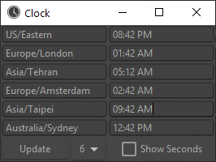

# Small GUI for a compact world clock
<https://github.com/poikilos/world_clock> (fork of <https://github.com/kavehtehrani/world_clock>)

With other multi-timezone clocks you can see where has what time, but
with world_clock you can see who! You can add a person's name or any
custom note to any clock, and even add more than one with the same
timezone.

Save to the cloud if you have a working Nextcloud/profile/ or
ownCloud/profile/ directory in your user folder! This program does not
use a web API. It simply uses one of those directories if it is there,
instead of the default which is AppData (or .config for GNU+Linux
systems, or Application Support for Darwin).

## Differences in Poikilos' fork
- It saves to a proper appdata folder for the OS, or to a cloud profile.
- You can add a note to any clock.
- Allow some colloquial timezones in the auto-complete (There are some manually-defined auto-complete strings not just technical ones from pytz.all_timezones).
  - The feedback for correct or incorrect strings is improved.
  - See [worldclocktk/__init__.py](worldclocktk/__init__.py) for the complete list.
- The installation has been standardized (There is a requirements.txt file and a setup.py file.
  - There is also a special setup.sh you can run afterward to get a visible icon if you have a GNU+Linux desktop.
- The custom icon appears on the taskbar on both Windows and GNU+Linux systems.

upstream screenshot, before adding notes feature:

## Install
- cd to the directory of the program
- pip install setup.py
- If you are using Python 2 (Run `python --version` to check), you must:
  - Download pyyaml from <https://www.lfd.uci.edu/~gohlke/pythonlibs/#pyyaml> for your version of python (cp27 for Python 2.7 for example, and amd64 in most cases [64-bit Windows, AMD or Intel]).
  - Open a Command Prompt
  - `cd Downloads`
  - `pip install PyYAML‑5.3‑cp27‑cp27m‑win_amd64.whl` (replace `PyYAML‑5.3‑cp27‑cp27m‑win_amd64.whl` with the correct one you downloaded for your Python and OS)
- install via `pip install`
- Make a shortcut (On Windows, make the shortcut to (replace `C:\Python27` with your Python installation) `C:\Python27\Scripts\world_clock.exe` and choose the icon from `C:\Python27\lib\site-packages\world_clock\assets\`)
